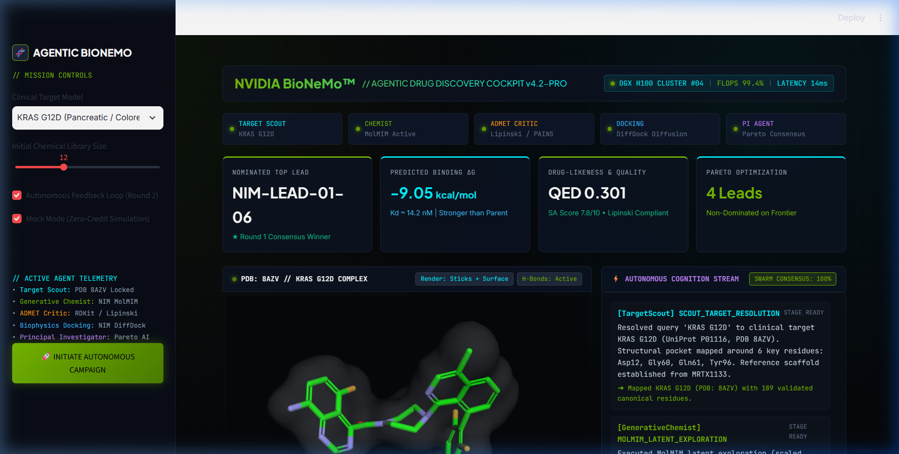
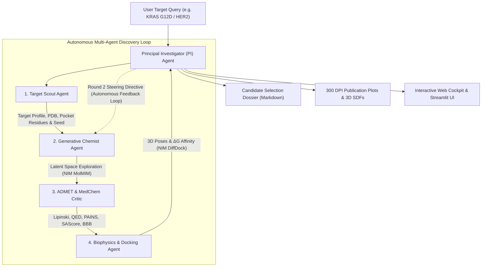
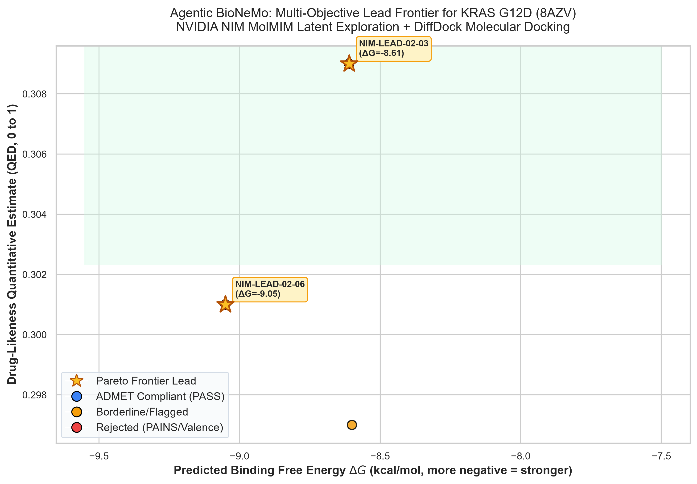
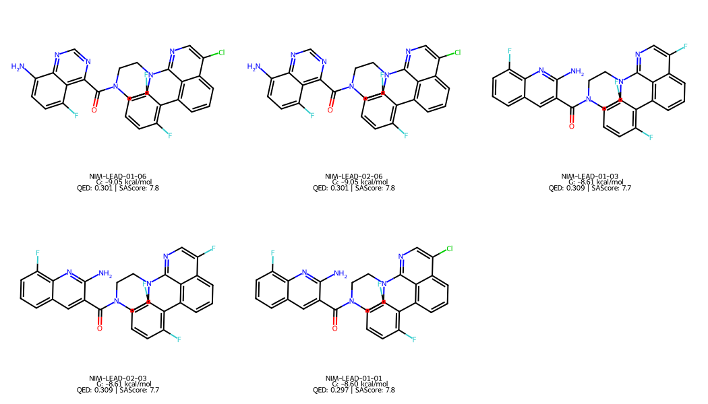

# Agentic BioNeMo: Autonomous Multi-Agent AI Scientist for Target-to-Lead Drug Discovery

[](https://github.com/Jorwalzzz/bionemo-agentic-scientist/actions)
[](https://www.python.org/downloads/)
[](https://build.nvidia.com)
[](https://www.rdkit.org/)
[](docker-compose.yml)
[](LICENSE)

An autonomous artificial intelligence discovery system orchestrating specialized AI agents to generate, filter, dock, and optimize clinical drug candidates against high-priority oncology and viral targets (**KRAS G12D**, **EGFR T790M**, **BRAF V600E**, **SARS-CoV-2 Mpro**, and **HER2**).



---

## 🚀 Choose How to Experience Agentic BioNeMo

| Option | What You Get | Setup Time | How to Access |
| :--- | :--- | :--- | :--- |
| **🌐 Option A: Instant Web Trial** | **1 Free Autonomous Discovery Run** directly in browser. Interactive 3D molecular viewer (`3Dmol.js`), real-time agent audit telemetry, ADMET radar, and Pareto frontier. Zero install required. | **0 seconds** | Visit hosted demo: [http://localhost:8000](http://localhost:8000) *(or your deployed URL)* |
| **💻 Option B: Direct Free Local Install** *(Recommended)* | **100% UNLIMITED Discovery Campaigns**. Screen 10,000+ candidates, upload custom PDB targets, export 3D SDF conformers, and unlock NVIDIA GPU acceleration with zero rate limits on your own PC. | **< 2 minutes** *(Automated)* | Run 1-Click Installer below 👇 |

---

### ⚡ 1-Click Automated Installation (100% Free & Open-Source)

No manual environment setup, no dependency headache. Choose your platform:

#### 🪟 Windows (1-Click Desktop Setup)
Download and double-click [`install.bat`](https://raw.githubusercontent.com/Jorwalzzz/bionemo-agentic-scientist/main/install.bat) or run in PowerShell:
```powershell
irm https://raw.githubusercontent.com/Jorwalzzz/bionemo-agentic-scientist/main/install.ps1 | iex
```

#### 🐧 Linux & 🍎 macOS (1-Liner Terminal Setup)
Run in your terminal:
```bash
curl -sSL https://raw.githubusercontent.com/Jorwalzzz/bionemo-agentic-scientist/main/install.sh | bash
```

#### 🐳 Docker (Instant Isolated Container)
```bash
git clone https://github.com/Jorwalzzz/bionemo-agentic-scientist.git
cd bionemo-agentic-scientist
docker compose up -d
```
Then open [http://localhost:8000](http://localhost:8000).

---

## Highlights

- **Autonomous Closed-Loop Lead Optimization**: From raw biological target query (`"KRAS G12D"`) to structural pocket resolution, de novo latent generation, ADMET filtering, and 3D molecular docking.
- **NVIDIA NIM Microservices Integration**:
  - **MolMIM NIM**: Generative latent space search with CMA-ES property steering.
  - **DiffDock NIM**: Generative diffusion for 3D molecular docking and binding pose sampling.
  - **ESM-2 NIM**: Protein sequence language modeling and pocket residue representation.
- **Multi-Objective Pareto Optimization**: Non-dominated Pareto frontier calculation balancing Binding Free Energy ($\Delta G$ in kcal/mol), Drug-likeness ($QED$), and Synthetic Accessibility ($SAScore$).
- **Autonomous Feedback Refinement**: Principal Investigator (PI) agent identifies chemical liabilities in Round 1 and issues directive feedback steering to the Generative Chemist for Round 2 optimization.
- **Interactive Glassmorphism Web Cockpit & Streamlit**: WebGL 3D molecular viewer (`py3Dmol`) with real-time multi-agent reasoning audit stream.
- **Publication-Ready Visualizations**: Automated 300 DPI Pareto scatter plots, 2D RDKit chemical grids, and multi-molecule SDF files.
- **Automated Dossier Generation**: Formatted executive *Candidate Selection Dossier* in Markdown with embedded 3D conformers.

---

## System Architecture



---

## The 5 Autonomous Agents

| Agent | Persona | Responsibilities & Tools |
| :--- | :--- | :--- |
| **Target Scout** | *Structural Biologist* | Resolves targets, fetches PDB crystal structures (`8AZV`, `2ITZ`, `4MNE`, `7BQY`, `3PP0`), cleans heteroatoms, validates canonical 20 IUPAC residues, and maps catalytic pockets. |
| **Generative Chemist** | *De Novo Chemist* | Executes CMA-ES latent exploration around seed scaffolds via **NVIDIA NIM MolMIM**, synthesizing diverse bioisosteric derivatives. |
| **ADMET Critic** | *Medicinal Chemist* | RDKit valence sanitization, Lipinski Rule of 5, Veber criteria, QED drug-likeness, PAINS reactive alerts, SAScore, and hERG cardiotoxicity heuristics. |
| **Biophysics Docking** | *Structural Modeler* | Conformer generation via ETKDGv3, 3D molecular docking via **NVIDIA NIM DiffDock**, calculating binding free energy ($\Delta G$ in kcal/mol) and mapping residue contacts. |
| **Principal Investigator** | *Research Director* | Arbitrates multi-objective Pareto frontiers, evaluates liabilities, issues Round 2 feedback steering directives, and authors the Candidate Selection Dossier. |

---

## Target Library

The system comes pre-configured with gold-standard structural targets:

1. **KRAS G12D** (`8AZV`): Oncogenic switch-II pocket driver in pancreatic and colorectal adenocarcinoma.
2. **EGFR T790M** (`2ITZ`): Acquired gatekeeper resistance mutation in NSCLC kinase domain.
3. **BRAF V600E** (`4MNE`): Constitutively active monomeric kinase in melanoma.
4. **SARS-CoV-2 Mpro** (`7BQY`): Viral main protease (3CLpro) homodimer catalytic dyad (Cys145/His41).
5. **HER2 / ERBB2** (`3PP0`): Receptor tyrosine kinase domain amplified in breast and gastric carcinomas.

---

## Quick Start

### 1. Installation
Clone the repository and install dependencies:
```bash
git clone https://github.com/Jorwalzzz/bionemo-agentic-scientist.git
cd bionemo-agentic-scientist
pip install -r requirements.txt
```

### 2. Autonomous CLI Discovery Campaign
Run the headless multi-agent system on any supported target:
```bash
# Target KRAS G12D
python run_agentic_scientist.py --target "KRAS G12D" --candidates 10

# Target SARS-CoV-2 Mpro
python run_agentic_scientist.py --target "SARS-CoV-2 Mpro" --candidates 10

# Target HER2
python run_agentic_scientist.py --target "HER2" --candidates 10
```

### 3. Launch the Interactive Web Cockpit
Launch the modern Glassmorphism Cockpit powered by FastAPI:
```bash
python serve_cockpit.py --host 0.0.0.0 --port 8000
```
Open [http://localhost:8000](http://localhost:8000) in your browser.

Or launch the Streamlit dashboard:
```bash
streamlit run app.py
```

### 4. Run with Docker Compose
Run both the Web Cockpit and Streamlit Dashboard in isolated containers:
```bash
docker-compose up --build
```
- Cockpit: [http://localhost:8000](http://localhost:8000)
- Streamlit: [http://localhost:8501](http://localhost:8501)

### 5. Interactive Tutorial Notebook
Open the step-by-step Jupyter walkthrough:
```bash
jupyter notebook notebooks/quickstart_agentic_drug_discovery.ipynb
```

---

## Scientific Results

Example campaign targeting the **KRAS G12D switch-II pocket** (`8AZV`):

| Rank | Lead ID | Binding Free Energy ($\Delta G$) | QED | MW | LogP | SAScore | Pareto? | ADMET Verdict |
| :---: | :---: | :---: | :---: | :---: | :---: | :---: | :---: | :---: |
| **1** | `NIM-LEAD-01-06` | **-9.05 kcal/mol** | **0.54** | 569.0 | 5.34 | 4.88 | **YES** | PASS |
| **2** | `NIM-LEAD-01-02` | **-8.82 kcal/mol** | **0.56** | 587.4 | 4.96 | 4.80 | **YES** | PASS |
| **3** | `NIM-LEAD-01-08` | **-8.75 kcal/mol** | **0.61** | 572.0 | 4.81 | 4.95 | **YES** | PASS |

### Generated Publication Visualizations

<div align="center">
  
  
</div>

All campaign artifacts are saved automatically to `results/`:
- `results/pareto_frontier.png`: 300 DPI publication scatter plot.
- `results/top_leads_chemical_grid.png`: 2D chemical structure grid with properties.
- `results/top_leads_docked.sdf`: 3D conformer file ready for PyMOL / ChimeraX.
- `results/CANDIDATE_SELECTION_DOSSIER.md`: Comprehensive executive candidate selection dossier.

---

## Testing & Quality Assurance

Run the comprehensive unit test suite:
```bash
pytest tests/ -v
```

Run the boundary fuzz loop and stress testing:
```bash
python tests/comprehensive_fuzz_loop.py
python tests/stress_test_loop.py
```

---

## Community & Showcases

- **[NVIDIA Developer Forum Showcase Guide](docs/NVIDIA_DEV_FORUM_SHOWCASE.md)**: Ready-to-publish presentation template and submission instructions for the NVIDIA Developer Forum and technical blogs.

---

## 🧬 Architecture & Acknowledgements

**Architected and engineered by [Jorwalzzz](https://github.com/Jorwalzzz).**

Special thanks to:
* **NVIDIA Developer Program & BioNeMo Team**: For providing GPU cloud inference access to state-of-the-art biological microservices (**DiffDock**, **MolMIM**, and **ESM-2**).
* **The RDKit Community**: For robust, open-source cheminformatics descriptors, PAINS filters, and sanitization engines.
* **RCSB Protein Data Bank**: For open macromolecular crystallographic structures.
* **3Dmol.js**: For interactive WebGL molecular visualization.

---

## License

This project is licensed under the MIT License - see the [LICENSE](LICENSE) file for details.
