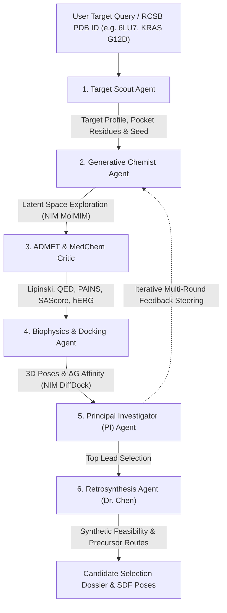

# Agentic BioNeMo: Autonomous Multi-Agent AI Scientist for Target-to-Lead Drug Discovery

[](https://github.com/Jorwalzzz/bionemo-agentic-scientist/actions)
[](https://www.python.org/downloads/)
[](https://build.nvidia.com)
[](https://www.rdkit.org/)
[](docker-compose.yml)
[](LICENSE)

An autonomous multi-agent artificial intelligence discovery system orchestrating specialized AI sub-agents to ingest biological targets, generate bioisosteric small molecules, screen ADMET liabilities, simulate 3D receptor-ligand docking, and map wet-lab retrosynthesis routes.

Architected & engineered by **[Jorwalzzz](https://github.com/Jorwalzzz)** with special thanks to the **NVIDIA BioNeMo™ & NIM™** ecosystem.

---

## 🚀 Experience Agentic BioNeMo

| Option | What You Get | Setup Time | How to Access |
| :--- | :--- | :--- | :--- |
| **🌐 Option A: Public Web Trial** | **Free Autonomous Discovery Run** directly in browser. Interactive 3D molecular viewer, real-time agent audit telemetry, ADMET radar, and Pareto frontier. Zero install required. | **0 seconds** | [https://bionemo-agentic-scientist.onrender.com](https://bionemo-agentic-scientist.onrender.com) |
| **💻 Option B: Direct Free Local Install** *(Recommended)* | **100% UNLIMITED Discovery Campaigns**. Screen 10,000+ candidates, upload custom PDB targets, interactive Chemical Workbench with live 3D re-docking, export 3D SDF conformers, and unlock NVIDIA GPU acceleration with zero rate limits on your own PC. | **< 2 minutes** *(Automated)* | Run 1-Click Installer below 👇 |

---

### ⚡ 1-Click Automated Installation (100% Free & Open-Source)

No manual environment setup or dependency headache. Choose your platform:

#### 🪟 Windows (1-Click Desktop Setup)
Download and double-click [`install.bat`](https://raw.githubusercontent.com/Jorwalzzz/bionemo-agentic-scientist/main/install.bat) or run in PowerShell:
```powershell
irm https://raw.githubusercontent.com/Jorwalzzz/bionemo-agentic-scientist/main/install.ps1 | iex
```

#### 🐧 Linux & 🍎 macOS (1-Liner Terminal Setup)
Run in your terminal:
```bash
curl -sSL https://raw.githubusercontent.com/Jorwalzzz/bionemo-agentic-scientist/main/install.sh | bash
```

#### 🐳 Docker (Instant Isolated Container)
```bash
git clone https://github.com/Jorwalzzz/bionemo-agentic-scientist.git
cd bionemo-agentic-scientist
docker compose up -d
```
Then open [http://localhost:8000](http://localhost:8000).

---


---

## 🔑 Obtaining Your Free NVIDIA API Key (1,000 Free Credits)

To run live GPU inference against NVIDIA's hosted foundation models (MolMIM, DiffDock, ESM-2), claim your **1,000 free credits**:

1. **Sign Up**: Visit [build.nvidia.com](https://build.nvidia.com) and click **Sign In** (free with Google, GitHub, or Email).
2. **Generate API Key**: Navigate to any biological NIM (e.g. [MolMIM](https://build.nvidia.com/nvidia/molmim) or [DiffDock](https://build.nvidia.com/mit/diffdock)) and click **"Get API Key"**. Your key starts with `nvapi-...`.
3. **Configure Locally**: Open the `.env` file in the project folder and paste your key:
   ```bash
   NVIDIA_API_KEY=nvapi-your-key-here
   USE_MOCK=false
   ```

> [!TIP]
> **Zero Credits or Offline?** Agentic BioNeMo automatically operates in high-fidelity offline simulation mode if no API key is set. You can run 100% unlimited discovery campaigns locally without ever spending a cent.

## 🌟 Highlights

- **Universal Target Ingestion**: Fetch and clean any crystallographic structure live from the **RCSB Protein Data Bank** using its 4-letter PDB ID (e.g. `6LU7`, `2ITZ`, `8AZV`, `7BQY`) or select curated clinical oncology targets (**KRAS G12D**, **EGFR T790M**, **SARS-CoV-2 Mpro**, **HER2**).
- **Multi-Sub-Agent Swarm Council**: Real-time cross-agent deliberations between Structural Biologist, Generative Chemist, ADMET Critic, Biophysics Modeler, Retrosynthesis Planner, and Principal Investigator.
- **NVIDIA NIM Microservices Integration**:
  - **MolMIM NIM**: Generative latent space search with CMA-ES property steering.
  - **DiffDock NIM**: Generative diffusion for 3D molecular docking and binding pose sampling.
  - **ESM-2 NIM**: Protein sequence language modeling and pocket residue representation.
- **Interactive Chemical Workbench**: Modify candidates live in browser (add magic fluorine `-F`, add methyl `-CH3`, swap phenyl to pyridine) and trigger instantaneous 3D re-docking.
- **Dr. Chen's Wet-Lab Retrosynthesis**: Automated multi-step reaction route generation (Suzuki coupling, amide condensation, SNAr, click chemistry) with commercial precursors, catalytic conditions, and yield forecasts.
- **Multi-Objective Pareto Optimization**: Non-dominated Pareto frontier calculation balancing Binding Free Energy ($\Delta G$ in kcal/mol), Drug-likeness ($QED$), and Synthetic Accessibility ($SAScore$).
- **Dual Interface**:
  - **Web Cockpit**: Modern Obsidian & NVIDIA Green glassmorphism cockpit ([http://localhost:8000](http://localhost:8000)).
  - **CLI Runner**: Headless terminal runner (`python run_agentic_scientist.py --target 6LU7 --candidates 10`).
- **Publication-Ready Visualizations**: Automated 300 DPI Pareto scatter plots, 2D RDKit chemical grids, multi-molecule SDF files, and formal Markdown dossiers.

---

## System Architecture



---

## The 6 Autonomous Swarm Agents

| Agent | Persona | Responsibilities & Tools |
| :--- | :--- | :--- |
| **Target Scout** | *Structural Biologist* | Resolves targets, fetches PDB crystal structures (`6LU7`, `8AZV`, `2ITZ`, `7BQY`, `3PP0`), cleans heteroatoms, validates canonical 20 IUPAC residues, and maps catalytic pockets. |
| **Generative Chemist** | *De Novo Chemist* | Executes CMA-ES latent exploration around seed scaffolds via **NVIDIA NIM MolMIM**, synthesizing diverse bioisosteric derivatives. |
| **ADMET Critic** | *Medicinal Chemist* | RDKit valence sanitization, Lipinski Rule of 5, Veber criteria, QED drug-likeness, PAINS reactive alerts, SAScore, and hERG cardiotoxicity heuristics. |
| **Biophysics Docking** | *Structural Modeler* | Conformer generation via ETKDGv3, 3D molecular docking via **NVIDIA NIM DiffDock**, calculating binding free energy ($\Delta G$ in kcal/mol) and mapping residue contacts. |
| **Retrosynthesis Agent** | *Synthetic Organic Chemist* | Deconstructs nominated leads into commercially accessible precursors, calculates step yields, selects catalysts, and estimates wet-lab turnaround times. |
| **Principal Investigator** | *Research Director* | Arbitrates multi-objective Pareto frontiers, evaluates liabilities, issues feedback steering directives, and authors the formal Candidate Selection Dossier. |

---

## Running Locally

### CLI Mode
```bash
python run_agentic_scientist.py --target 6LU7 --candidates 10 --output results
```

### Web Cockpit
```bash
python serve_cockpit.py
```
Visit [http://localhost:8000](http://localhost:8000) for the full cockpit with unlimited creator access.

---

## 📜 Acknowledgements & Attribution
- **Architect & Lead Engineer**: [Jorwalzzz](https://github.com/Jorwalzzz)
- **GPU Inference**: [NVIDIA Developer Program](https://developer.nvidia.com) & [NVIDIA BioNeMo Team](https://www.nvidia.com/cloudecosystem/bionemo/) (MolMIM, DiffDock, ESM-2)
- **Scientific Foundation**: RDKit, RCSB Protein Data Bank, Biopython, 3Dmol.js
